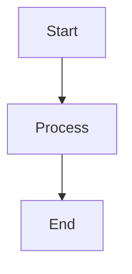
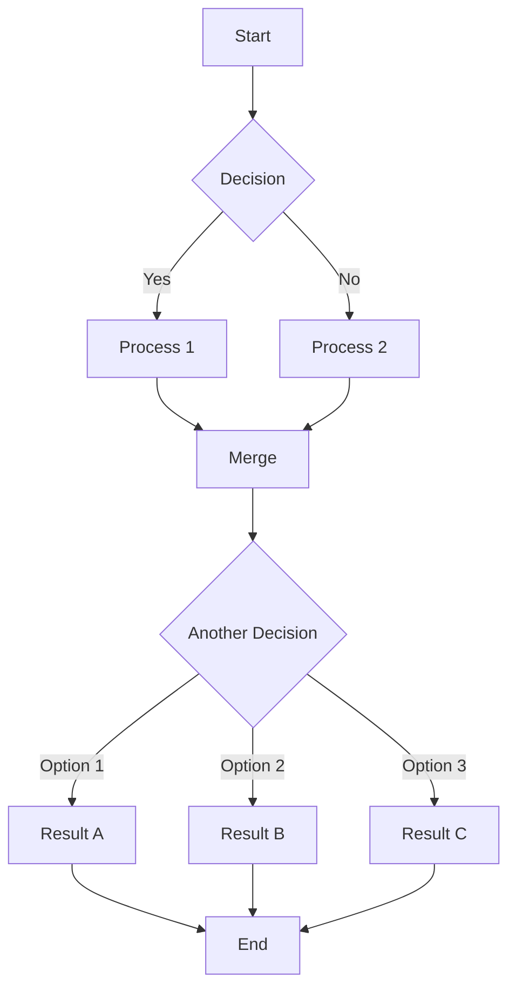

# Diagram Auto-Scale Feature Guide

## Overview

The diagram auto-scale feature automatically adjusts the height of diagram panels (blackboards/whiteboards) to fit their content, similar to the existing text panel auto-height feature. This ensures that all diagram content is visible without requiring manual height adjustments.

## Changes Made

### 1. Type Definition (`src/types/Story.ts`)

Added `autoScale` property to `DiagramStyle` interface:

```typescript
export interface DiagramStyle {
  // ... existing properties ...
  autoScale?: boolean; // If true, automatically scale panel to fit diagram content
  // ... rest of properties ...
}
```

### 2. Measurement Service (`src/services/DiagramRenderService.ts`)

Added `measureDiagramNaturalSize()` function that:
- Renders diagram content in a hidden container
- Measures the natural dimensions needed
- Returns optimal width and height to fit content
- Handles all diagram types: Mermaid, Math, Code, Markdown

### 3. Overlay Service (`src/services/OverlayService.ts`)

Updated `overlayDiagramOnImage()` to:
- Check if `autoScale` is enabled in diagram style
- Call `measureDiagramNaturalSize()` to get natural dimensions
- Use measured dimensions instead of percentage-based height
- Ensure panel doesn't exceed image bounds

### 4. UI Component (`src/components/StoriesPanel.tsx`)

Added toggle switch in diagram style configuration dialog:
- "Auto-scale height to fit content" switch
- Height percentage field is hidden when auto-scale is enabled
- Width percentage is still respected (content scales to fit width)

## How to Use

### 1. Configure Auto-Scale for a Story

1. In the **Stories** tab, find your story
2. Click the **⚙️ (settings)** icon next to the story
3. Select **Configure Diagram Style**
4. Enable the **"Auto-scale height to fit content"** switch
5. Set the desired width percentage (10-100%)
6. Click **Save**

### 2. Add Diagram Content to a Scene

1. Navigate to the **Scenes** tab
2. Select a scene with diagram content
3. In the **Diagram Panel** section:
   - Choose diagram type (Mermaid, Math, Code, or Markdown)
   - Enter your diagram content
   - Preview the diagram
4. Generate the image

The diagram panel will automatically size to fit the content height while respecting the width constraint.

## Testing Examples

### Test Case 1: Mermaid Flowchart (Small)

**Diagram Type:** Mermaid

**Content:**


**Expected Result:** Small panel that tightly fits the 3-node flowchart

---

### Test Case 2: Mermaid Flowchart (Large)

**Diagram Type:** Mermaid

**Content:**


**Expected Result:** Larger panel that fits the entire complex flowchart

---

### Test Case 3: Math Equations (Multiple Lines)

**Diagram Type:** Math (LaTeX)

**Content:**
```latex
x = \frac{-b \pm \sqrt{b^2 - 4ac}}{2a}
E = mc^2
a^2 + b^2 = c^2
\int_{0}^{\infty} e^{-x^2} dx = \frac{\sqrt{\pi}}{2}
```

**Expected Result:** Panel height adjusts to show all 4 equations with proper spacing

---

### Test Case 4: Code Block (Short)

**Diagram Type:** Code (JavaScript)

**Content:**
```javascript
function factorial(n) {
  return n <= 1 ? 1 : n * factorial(n - 1);
}
```

**Expected Result:** Compact panel for short function

---

### Test Case 5: Code Block (Long)

**Diagram Type:** Code (Python)

**Content:**
```python
def dijkstra(graph, start):
    """
    Find shortest paths from start node to all other nodes
    using Dijkstra's algorithm.
    """
    distances = {node: float('infinity') for node in graph}
    distances[start] = 0
    visited = set()
    priority_queue = [(0, start)]
    
    while priority_queue:
        current_distance, current_node = heapq.heappop(priority_queue)
        
        if current_node in visited:
            continue
            
        visited.add(current_node)
        
        for neighbor, weight in graph[current_node].items():
            distance = current_distance + weight
            
            if distance < distances[neighbor]:
                distances[neighbor] = distance
                heapq.heappush(priority_queue, (distance, neighbor))
    
    return distances
```

**Expected Result:** Tall panel that shows entire function with syntax highlighting

---

### Test Case 6: Markdown Text (Mixed Content)

**Diagram Type:** Markdown

**Content:**
```markdown
# Algorithm Steps

1. **Initialize** all distances to infinity
2. Set start node distance to **0**
3. **Repeat** until all nodes visited:
   - Select unvisited node with smallest distance
   - Mark it as visited
   - Update distances to neighbors
4. Return the distance table

*Time Complexity:* O((V + E) log V)

**Space Complexity:** O(V)
```

**Expected Result:** Panel automatically sizes to show all headings, lists, and formatted text

---

## Behavior Details

### Width Constraints
- Auto-scale respects the configured **width percentage**
- Content is rendered at the specified width
- If content is narrower, panel width may shrink to fit

### Height Calculation
- Height is measured after rendering content at target width
- Includes padding and border in final dimensions
- Maximum height is capped by image bounds (considering gutters)

### Comparison with Fixed Height
| Fixed Height | Auto-Scale |
|-------------|------------|
| Content may be clipped if too large | Always shows full content |
| Content may have excess whitespace if too small | Tightly fits content |
| User must manually adjust percentage | Automatically adjusts |
| Good for consistent sizing | Good for variable content |

### When Auto-Scale is Capped

If diagram content requires more height than available (image height minus gutters), the panel will:
1. Be sized to maximum available height
2. Enable scrolling within the panel (via `overflow: auto`)
3. Log a warning in console

## Performance Considerations

Auto-scaling requires two render passes:
1. **Measurement pass** - Render in hidden container to measure
2. **Final render pass** - Render at calculated dimensions

This adds minimal overhead (~50-100ms) and provides accurate sizing.

## Troubleshooting

### Issue: Panel is too tall and overlaps other elements
**Solution:** Check gutter settings in diagram style configuration. Increase `gutterTop` or `gutterBottom` to provide more space.

### Issue: Content is clipped even with auto-scale enabled
**Solution:** 
- Verify auto-scale toggle is ON in story diagram settings
- Check console for capping warnings
- Content may exceed maximum available height

### Issue: Width is not what I expected
**Solution:** Auto-scale adjusts HEIGHT only. Width is controlled by the "Width %" setting in diagram style configuration.

### Issue: Font size is too small/large
**Solution:** Adjust the "Font Size" setting in diagram style configuration. This affects text-based diagrams (math, code, markdown).

## Future Enhancements

Potential improvements for future versions:
- Auto-scale width in addition to height
- Smart positioning to avoid image important areas
- Preview of auto-scaled dimensions in UI
- Per-scene diagram style overrides
- Batch processing optimizations

---

## Summary

The auto-scale feature makes it easier to create professional-looking educational content by automatically sizing diagram panels to fit their content. Enable it once at the story level, and all scenes with diagrams will benefit from automatic sizing.

**Key Benefits:**
✅ No more manually adjusting height percentages  
✅ Content never gets clipped  
✅ Professional, consistent appearance  
✅ Works with all diagram types  
✅ Similar to existing text panel auto-height  


