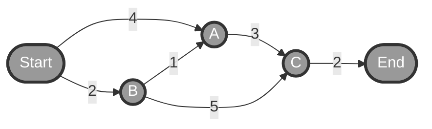

# Dijkstra's Algorithm Progress Tracker

This document tracks the state of Dijkstra's algorithm at each step as depicted in "The Wonderful Journey of Dijkstra's Quest".

## Graph Structure

```
Start --4--> A --3--> C --2--> End
  |                    ^
  2                    |
  v                    5
  B -------------------+
  |
  1
  v
  A
```

**Edges:**
- Start → A: 4
- Start → B: 2
- B → A: 1
- B → C: 5
- A → C: 3
- C → End: 2

---

## Step 1: Initialization (Scene 1: "The Beginning")

**Current State:**
- **Distances:** Start=0, A=∞, B=∞, C=∞, End=∞
- **Priority Queue:** `[(Start, 0)]`
- **Visited Nodes:** `[]`

**Action:** Initialize the start node with distance 0 and add to priority queue.

---

## Step 2: Visit Start (Scene 2: "Exploring from Start")

**Processing:** Start (distance = 0)

**Neighbor Updates:**
- Start → A (cost 4): distance[A] = 0 + 4 = **4**
- Start → B (cost 2): distance[B] = 0 + 2 = **2**

**Current State:**
- **Distances:** Start=0, A=4, B=2, C=∞, End=∞
- **Priority Queue:** `[(B, 2), (A, 4)]`
- **Visited Nodes:** `[Start]`

**Next:** B has the smallest distance (2)

---

## Step 3: Visit B (Scene 3: "Visiting B - The Closest Node")

**Processing:** B (distance = 2)

**Neighbor Updates:**
- B → A (cost 1): distance[A] = 2 + 1 = **3** (improved from 4!)
- B → C (cost 5): distance[C] = 2 + 5 = **7**

**Current State:**
- **Distances:** Start=0, B=2, A=3, C=7, End=∞
- **Priority Queue:** `[(A, 3), (C, 7)]`
- **Visited Nodes:** `[Start, B]`

**Next:** A has the smallest distance (3)

---

## Step 4: Visit A (Scene 4: "Visiting A - Finding Better Paths")

**Processing:** A (distance = 3)

**Neighbor Updates:**
- A → C (cost 3): distance[C] = 3 + 3 = **6** (improved from 7!)

**Current State:**
- **Distances:** Start=0, B=2, A=3, C=6, End=∞
- **Priority Queue:** `[(C, 6)]`
- **Visited Nodes:** `[Start, B, A]`

**Next:** C has the smallest distance (6)

---

## Step 5: Visit C (Scene 5: "Visiting C - Almost There!")

**Processing:** C (distance = 6)

**Neighbor Updates:**
- C → End (cost 2): distance[End] = 6 + 2 = **8**

**Current State:**
- **Distances:** Start=0, B=2, A=3, C=6, End=8
- **Priority Queue:** `[(End, 8)]`
- **Visited Nodes:** `[Start, B, A, C]`

**Next:** End is the last node to visit

---

## Step 6: Visit End (Scene 6: "The End - Path Complete!")

**Processing:** End (distance = 8)

**Neighbor Updates:** None (End has no outgoing edges)

**Final State:**
- **Distances:** Start=0, B=2, A=3, C=6, End=8
- **Priority Queue:** `[]` (empty)
- **Visited Nodes:** `[Start, B, A, C, End]`

**Algorithm Complete!** ✨

---

## Final Shortest Path

**Path:** Start → B → A → C → End

**Total Distance:** 8

**Path Breakdown:**
1. Start → B (distance: 2)
2. B → A (distance: 1, cumulative: 3)
3. A → C (distance: 3, cumulative: 6)
4. C → End (distance: 2, cumulative: 8)

### Visual Representation



**Legend:** Gray nodes with bold borders indicate the shortest path found by Dijkstra's algorithm.

---

## Key Observations

1. **Greedy Selection:** At each step, we always visit the unvisited node with the smallest known distance.

2. **Relaxation:** When we visit a node, we check if going through it provides a shorter path to its neighbors:
   - A improved from 4 → 3 (going through B)
   - C improved from 7 → 6 (going through A instead of B)

3. **Optimality Guarantee:** Once a node is visited, its shortest distance is final and optimal.

4. **Priority Queue Order:** The priority queue always maintains nodes sorted by their current best-known distance, ensuring we process them in the correct order.

